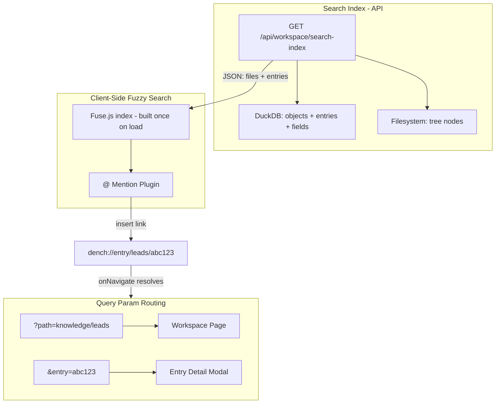

# @ Mention Search, Link System, and Entry Detail Modals

## Current Problems

1. **@ mention only searches files** -- entries (rows) in objects (tables) are invisible to the search. Uses naive `String.includes()` with no fuzzy matching.
2. **File links are broken** -- `buildFileItems` in [slash-command.tsx](apps/web/app/components/workspace/slash-command.tsx) sets `href: node.path` (e.g. `knowledge/leads`), but `onNavigate` in [workspace/page.tsx](apps/web/app/workspace/page.tsx) calls `findNode(tree, path)` which may not resolve correctly depending on whether the path includes `knowledge/` prefix. No canonical link format exists.
3. **No entry detail view** -- table rows in [object-table.tsx](apps/web/app/components/workspace/object-table.tsx) are not clickable. There is no modal, route, or UI to view a single entry.
4. **No URL-based navigation** -- navigating to content is purely callback-based (state updates). The URL only updates on initial load via `?path=`. Sharing a link to a specific entry is impossible.

---

## Architecture



---

## Phase 1: Search Index API Endpoint

**New file:** `apps/web/app/api/workspace/search-index/route.ts`

Returns a flat JSON array of all searchable items -- both files and entry rows from every object. The client fetches this once on workspace load and rebuilds on tree changes (SSE watcher already triggers refreshes).

```typescript
type SearchIndexItem = {
  // Shared
  id: string; // unique key (path for files, entryId for entries)
  label: string; // display text (filename or display-field value)
  sublabel?: string; // secondary text (path for files, object name for entries)
  kind: "file" | "object" | "entry";
  icon?: string;

  // For entries
  objectName?: string;
  entryId?: string;
  fields?: Record<string, string>; // first 3-4 field key-value pairs for preview

  // For files/objects
  path?: string;
  nodeType?: "document" | "folder" | "file" | "report" | "database";
};
```

**Server implementation:**

- Reuse existing `buildTree()` from [tree/route.ts](apps/web/app/api/workspace/tree/route.ts) for files
- For entries: query every object from DuckDB, resolve display fields, and return flattened entries with their first few field values as searchable text
- SQL: `SELECT * FROM v_{objectName} LIMIT 500` per object (capped for perf)
- Cache with short TTL or rely on client refetch on SSE tree-change events

---

## Phase 2: Client-Side Fuzzy Search with Fuse.js

**New file:** `apps/web/lib/search-index.ts`

A React hook `useSearchIndex()` that:

1. Fetches `/api/workspace/search-index` once on mount
2. Builds a `Fuse` instance over the items, keyed on `label`, `sublabel`, and `fields` values
3. Exposes a `search(query: string): SearchIndexItem[]` function
4. Rebuilds when tree changes (listen to same SSE watcher signal)

**Fuse.js config:**

- Keys: `["label", "sublabel", "objectName", "fields.*"]` with weighted scoring
- Threshold: ~0.4 (tolerant fuzzy)
- Max results: 20

**Update [slash-command.tsx](apps/web/app/components/workspace/slash-command.tsx):**

Replace `createFileMention(tree)` with `createWorkspaceMention(searchFn)`:

- `items` callback uses the Fuse search function instead of `flattenTree` + `.includes()`
- Results are grouped: show files first, then entries grouped by object
- The `CommandList` component gets a minor update to show entry items differently (object badge, field preview)

**Dep:** Add `fuse.js` to `apps/web/package.json` -- lightweight (~7KB gzipped), runs entirely client-side, no wasm.

---

## Phase 3: Canonical Internal Link Format

Define a URI scheme for internal workspace links, parsed in a single utility:

**New file:** `apps/web/lib/workspace-links.ts`

```typescript
// Canonical formats:
// Files:   "knowledge/path/to/doc.md"  (relative path, unchanged)
// Objects: "knowledge/leads"           (relative path, unchanged)
// Entries: "@entry/leads/abc123"       (new: @entry/{objectName}/{entryId})

type WorkspaceLink =
  | { kind: "file"; path: string }
  | { kind: "object"; objectName: string; path: string }
  | { kind: "entry"; objectName: string; entryId: string };

function parseWorkspaceLink(href: string): WorkspaceLink;
function buildEntryLink(objectName: string, entryId: string): string;
function buildFileLink(path: string): string;
function workspaceLinkToUrl(link: WorkspaceLink): string;
// Returns: "/workspace?path=knowledge/leads" or "/workspace?path=knowledge/leads&entry=abc123"
```

**Update mention insert command** in `slash-command.tsx`:

- File items: keep `href: node.path` (unchanged)
- Entry items: use `href: "@entry/{objectName}/{entryId}"`, display text = display field value

**Update link click handler** in [markdown-editor.tsx](apps/web/app/components/workspace/markdown-editor.tsx) (lines 215-238):

- Parse the href with `parseWorkspaceLink()`
- For file/object links: `onNavigate(link.path)` (as today, but path resolution fixed)
- For entry links: `onNavigate("@entry/leads/abc123")` -- parent resolves to modal

**Update workspace page** `onNavigate` handler:

- Parse the link, and if it's an `@entry/...` link, set query params to open the entry modal
- If it's a file/object link, do `findNode(tree, path)` as before but with proper path normalization

---

## Phase 4: Entry Detail Modal with Query Param Routing

**URL pattern:** `/workspace?path=knowledge/leads&entry=abc123`

When `entry` query param is present, render an `EntryDetailModal` as an overlay on top of the current workspace content.

**New file:** `apps/web/app/components/workspace/entry-detail-modal.tsx`

- Full-screen overlay/side panel with entry data
- Fetches entry data from a new API endpoint or uses already-loaded object data
- Renders all fields with proper type-specific display (reuse `CellValue` from [object-table.tsx](apps/web/app/components/workspace/object-table.tsx))
- Relation fields are clickable -- clicking opens the related entry's modal (updates `entry` param)
- Close button / Escape / clicking backdrop clears the `entry` param
- URL is shareable and bookmarkable

**New API:** `GET /api/workspace/objects/[name]/entries/[id]`

- Returns a single entry with all field values, resolved relation labels, and reverse relations
- Lightweight endpoint for the modal to fetch data without loading the full object

**Update [workspace/page.tsx](apps/web/app/workspace/page.tsx):**

- Read `entry` from `searchParams`
- When present, render `<EntryDetailModal>` on top of current content
- Update URL using `router.replace()` (shallow) when opening/closing modal -- no full page navigation
- On initial load, if both `path` and `entry` are set, load the object AND open the modal

**Update [object-table.tsx](apps/web/app/components/workspace/object-table.tsx):**

- Make table rows clickable
- `onClick` handler calls a new `onEntryClick(entryId)` prop
- Parent sets the `entry` query param, opening the modal

---

## Phase 5: Fix Existing Link Navigation Bugs

**Bug 1:** Path resolution mismatch -- `node.path` from tree includes `knowledge/` prefix but link resolution sometimes strips it. Fix: normalize paths in `findNode()` and `onNavigate()` using the new `parseWorkspaceLink()`.

**Bug 2:** The `onNavigate` callback in `DocumentView` does `findNode(tree, path)` but the href from a markdown link may not exactly match a tree path (e.g., `leads` vs `knowledge/leads`). Fix: add fallback resolution that tries with/without `knowledge/` prefix, and tries matching the last segment against object names.

**Bug 3:** No URL update when navigating -- selecting a sidebar item or clicking a link updates state but not the URL bar. Fix: use `router.replace()` to keep URL in sync with `activePath` so links are shareable.

---

## Key Files to Modify

- [apps/web/app/components/workspace/slash-command.tsx](apps/web/app/components/workspace/slash-command.tsx) -- Replace file-only search with unified fuzzy search over files + entries
- [apps/web/app/components/workspace/markdown-editor.tsx](apps/web/app/components/workspace/markdown-editor.tsx) -- Fix link click handler to support entry links
- [apps/web/app/workspace/page.tsx](apps/web/app/workspace/page.tsx) -- Add entry modal rendering, fix URL sync, fix `onNavigate` resolution
- [apps/web/app/components/workspace/object-table.tsx](apps/web/app/components/workspace/object-table.tsx) -- Make rows clickable with `onEntryClick`

## New Files

- `apps/web/app/api/workspace/search-index/route.ts` -- Search index endpoint
- `apps/web/app/api/workspace/objects/[name]/entries/[id]/route.ts` -- Single entry endpoint
- `apps/web/lib/workspace-links.ts` -- Link parsing/building utilities
- `apps/web/lib/search-index.ts` -- Client-side Fuse.js hook
- `apps/web/app/components/workspace/entry-detail-modal.tsx` -- Entry modal component
