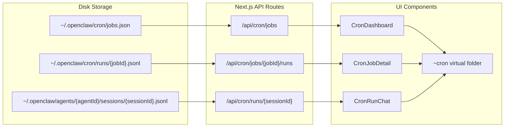

# Web Cron Dashboard

## Architecture

The cron system stores its data at:

- **Job definitions**: `~/.openclaw/cron/jobs.json` (`CronStoreFile` with `CronJob[]`)
- **Run logs per job**: `~/.openclaw/cron/runs/{jobId}.jsonl` (`CronRunLogEntry` per line)
- **Run session transcripts**: `~/.openclaw/agents/{agentId}/sessions/{sessionId}.jsonl`

The web app does NOT connect to the gateway directly -- it reads files from disk via Next.js API routes (same pattern as existing `/api/sessions`, `/api/web-sessions`). No gateway WebSocket integration needed.



## 1. API Routes

### `GET /api/cron/jobs` -- [apps/web/app/api/cron/jobs/route.ts](apps/web/app/api/cron/jobs/route.ts)

Read `~/.openclaw/cron/jobs.json` and return all jobs with computed status fields. Also scan `~/.openclaw/cron/runs/` to get latest run info. Include heartbeat info by reading agent config from `~/.openclaw/config.yaml` (heartbeat interval, next due estimate).

Returns:

```typescript
{
  jobs: CronJob[],
  heartbeat: {
    intervalMs: number,
    nextDueEstimateMs: number | null
  },
  cronStatus: {
    enabled: boolean,
    nextWakeAtMs: number | null
  }
}
```

### `GET /api/cron/jobs/[jobId]/runs` -- [apps/web/app/api/cron/jobs/[jobId]/runs/route.ts](apps/web/app/api/cron/jobs/[jobId]/runs/route.ts)

Read `~/.openclaw/cron/runs/{jobId}.jsonl` using the same logic as `readCronRunLogEntries` in [src/cron/run-log.ts](src/cron/run-log.ts). Return entries with `?limit=N` support.

Returns:

```typescript
{ entries: CronRunLogEntry[] }
```

### `GET /api/cron/runs/[sessionId]` -- [apps/web/app/api/cron/runs/[sessionId]/route.ts](apps/web/app/api/cron/runs/[sessionId]/route.ts)

Find and read `~/.openclaw/agents/*/sessions/{sessionId}.jsonl` (same search pattern as existing [apps/web/app/api/sessions/[sessionId]/route.ts](apps/web/app/api/sessions/[sessionId]/route.ts)). Parse JSONL into messages including `thinking` blocks, tool calls, and text -- return the full conversation with all parts preserved (not truncated like the existing session API).

Returns:

```typescript
{
  sessionId: string,
  messages: Array<{
    id: string,
    role: "user" | "assistant",
    parts: Array<
      | { type: "text", text: string }
      | { type: "thinking", thinking: string }
      | { type: "tool-call", toolName: string, args: unknown, output?: string }
    >,
    timestamp: string
  }>
}
```

## 2. Sidebar Integration

In [apps/web/app/workspace/page.tsx](apps/web/app/workspace/page.tsx), add a `~cron` virtual folder alongside the existing `~chats` folder:

- Fetch cron jobs from `/api/cron/jobs` on mount (same pattern as `fetchSessions`).
- Build a `~cron` `TreeNode` folder with children:
  - Each job becomes a folder: `~cron/{jobId}` (name = job name, with status icon in the name string)
  - Clicking `~cron` opens the cron dashboard view
  - Clicking `~cron/{jobId}` opens the job detail view
- Handle `~cron` paths in `handleNodeSelect` (same pattern as `~chats`).

```typescript
const cronFolder: TreeNode = {
  name: "Cron",
  path: "~cron",
  type: "folder",
  virtual: true,
  children: cronJobs.map((j) => ({
    name: `${statusEmoji(j)} ${j.name}`,
    path: `~cron/${j.id}`,
    type: "folder",
    virtual: true,
  })),
};
return [...tree, chatsFolder, cronFolder];
```

## 3. UI Components

### CronDashboard ([apps/web/app/components/cron/cron-dashboard.tsx](apps/web/app/components/cron/cron-dashboard.tsx))

Shown when user clicks `~cron` in sidebar. Displays:

- **Heartbeat status card**: interval (e.g. "every 30m"), estimated next heartbeat as a live countdown, explanation of how heartbeat decides which cron jobs to run
- **Cron scheduler status**: enabled/disabled, next wake time as countdown
- **Jobs table/list**: all jobs with columns:
  - Name, Schedule (human-readable), Status (running/ok/error/disabled/idle), Next run (countdown), Last run (time-ago + duration), Session target (main/isolated)
  - Click a job row to navigate to its detail view
- **Timeline view**: visual timeline showing upcoming scheduled runs across all jobs (next 24h)

### CronJobDetail ([apps/web/app/components/cron/cron-job-detail.tsx](apps/web/app/components/cron/cron-job-detail.tsx))

Shown when user clicks `~cron/{jobId}`. Displays:

- **Job config header**: name, description, schedule (formatted), enabled status, session target, wake mode, payload summary
- **Next run countdown**: large countdown timer to next execution
- **Run history list**: each `CronRunLogEntry` as a card with:
  - Timestamp, status badge (ok/error/skipped), duration, summary text
  - Click to expand into full run chat (loads session transcript inline or navigates to run view)
- **Error details**: if `consecutiveErrors > 0`, show error streak and last error message

### CronRunChat ([apps/web/app/components/cron/cron-run-chat.tsx](apps/web/app/components/cron/cron-run-chat.tsx))

Displayed inline when expanding a run in `CronJobDetail`. Renders the full session transcript:

- Reuse `ChatMessage` and `ChainOfThought` components from [apps/web/app/components/chat-message.tsx](apps/web/app/components/chat-message.tsx) and [apps/web/app/components/chain-of-thought.tsx](apps/web/app/components/chain-of-thought.tsx) (or at minimum their rendering patterns)
- Show all thinking/reasoning blocks fully expanded (not collapsed, since these are historical runs)
- Show all tool calls with their inputs and outputs
- Show the system event / prompt that triggered the run
- Display run metadata at the top: model used, tokens consumed, duration

## 4. Content Routing in Workspace Page

Extend the `content` state in [apps/web/app/workspace/page.tsx](apps/web/app/workspace/page.tsx) with new kinds:

```typescript
type ContentState =
  | { kind: "none" }
  | { kind: "loading" }
  | { kind: "document"; ... }
  | { kind: "object"; ... }
  | { kind: "cron-dashboard"; jobs: CronJob[]; heartbeat: HeartbeatInfo }
  | { kind: "cron-job"; jobId: string; job: CronJob; runs: CronRunLogEntry[] }
```

In the main content area renderer, add cases for `cron-dashboard` and `cron-job` that render the corresponding components.

## 5. Data Types (shared)

Create [apps/web/app/types/cron.ts](apps/web/app/types/cron.ts) with client-side type definitions mirroring `CronJob`, `CronRunLogEntry`, `CronSchedule`, `CronJobState` etc. (copy from [src/cron/types.ts](src/cron/types.ts) and [src/cron/run-log.ts](src/cron/run-log.ts), stripped of server-only imports).

## Key Design Decisions

- **Read-only**: The cron UI is read-only (view jobs, runs, transcripts). No add/edit/delete/enable/disable from the web UI -- that stays in the CLI.
- **No gateway connection**: All data read directly from disk via API routes, consistent with the existing web app pattern.
- **Reuse existing components**: Chat rendering reuses `ChatMessage`/`ChainOfThought` patterns rather than building from scratch.
- **Live countdowns**: Use `setInterval` for countdown timers (next heartbeat, next cron run) with periodic refetch of job data to stay current.
- **Auto-refresh**: Poll `/api/cron/jobs` every ~30s to catch state changes from the running gateway.
